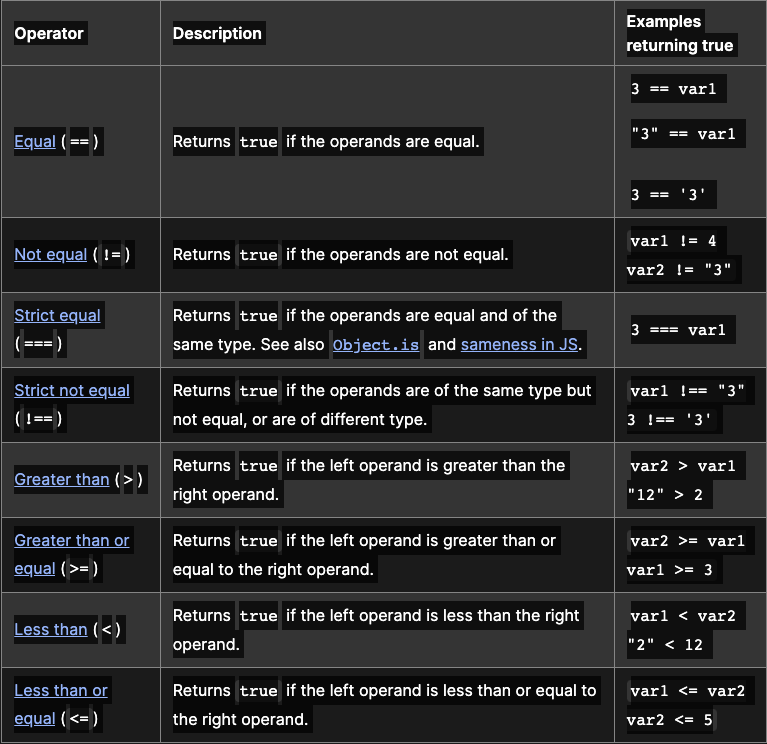
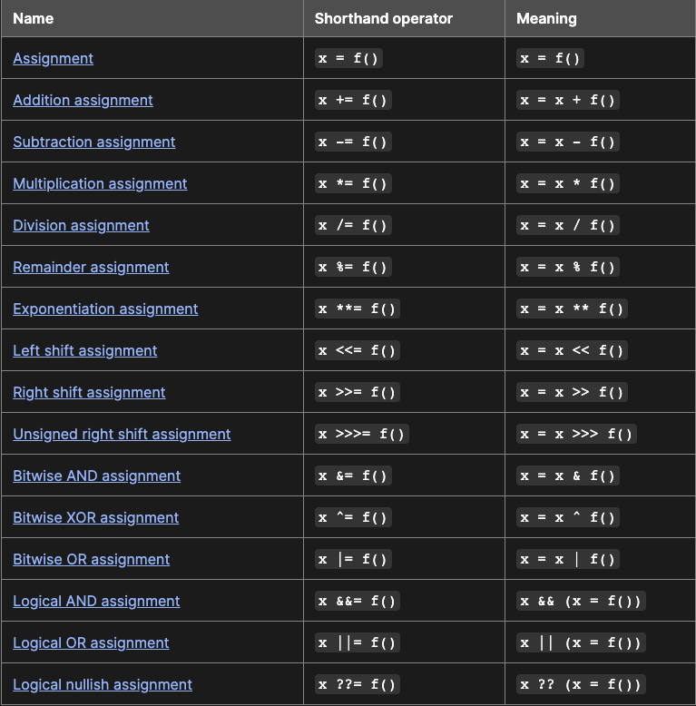

# Loops and iteration

## for statement

A for loop repeats until a specified condition evaluates to false. The JavaScript for loop is similar to the Java and C for loop.

A for statement looks as follows:

````
for ([initialExpression]; [conditionExpression]; [incrementExpression])
  statement

````

When a for loop executes, the following occurs:

- The initializing expression initialExpression, if any, is executed. This expression usually initializes one or more loop counters, but the syntax allows an expression of any degree of complexity. This expression can also declare variables.
- The conditionExpression expression is evaluated. If the value of conditionExpression is true, the loop statements execute. Otherwise, the for loop terminates. (If the conditionExpression expression is omitted entirely, the condition is assumed to be true.)
- The statement executes. To execute multiple statements, use a block statement ({ }) to group those statements.
- If present, the update expression incrementExpression is executed.
- Control returns to Step 2.

Example:

````
function howMany(selectObject) {
  let numberSelected = 0;
  for (let i = 0; i < selectObject.options.length; i++) {
    if (selectObject.options[i].selected) {
      numberSelected++;
    }
  }
  return numberSelected;
}

const btn = document.getElementById('btn');

btn.addEventListener('click', () => {
  const musicTypes = document.selectForm.musicTypes;
  console.log(`You have selected ${howMany(musicTypes)} option(s).`);
});

````

## While statement

A while statement executes its statements as long as a specified condition evaluates to true. A while statement looks as follows:

````
while (condition)
  statement

````

If the condition becomes false, statement within the loop stops executing and control passes to the statement following the loop.

The condition test occurs before statement in the loop is executed. If the condition returns true, statement is executed and the condition is tested again. If the condition returns false, execution stops, and control is passed to the statement following while.

To execute multiple statements, use a block statement ({ }) to group those statements.

Example:

````
let n = 0;
let x = 0;
while (n < 3) {
  n++;
  x += n;
}

````


With each iteration, the loop increments n and adds that value to x. Therefore, x and n take on the following values:

After the first pass: n = 1 and x = 1
After the second pass: n = 2 and x = 3
After the third pass: n = 3 and x = 6
After completing the third pass, the condition n < 3 is no longer true, so the loop terminates.

## Comparison operators

### Comparison operators



## Assignment operators

